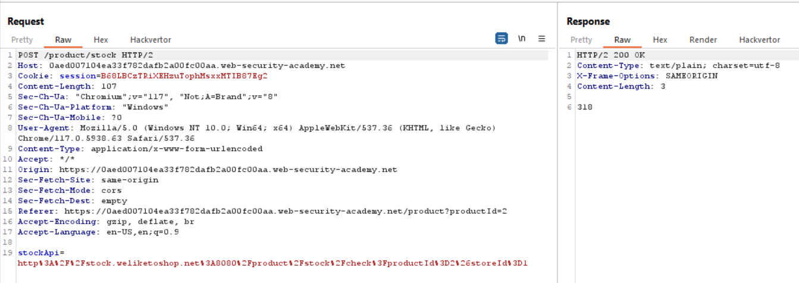

# Basic SSRF against the local server

1. SSRF: Stock check functionality.
2. Goal: Change the stock check URL to access the admin interface at http://localhost/admin and delete the user carlos.

### Analysis

- `(ctrl + shift + u)`: URL decode.

- Test SSRF Attack.

- You will see `admin` page.

- In admin page you gonna see Users.

- Delete carlos user.

