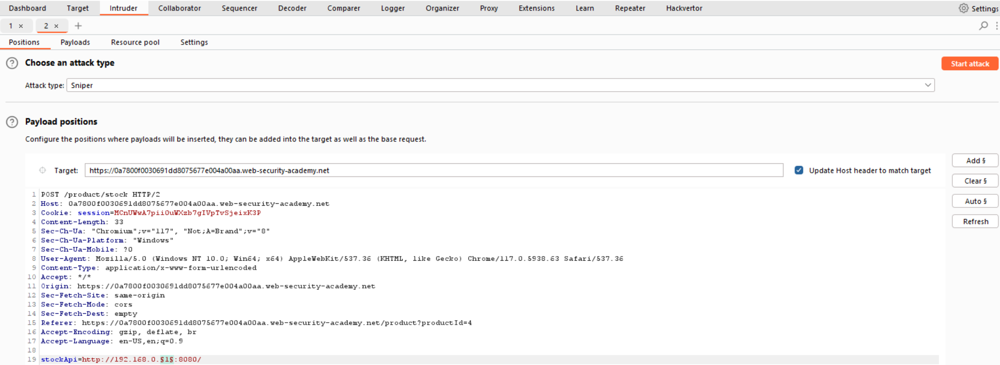
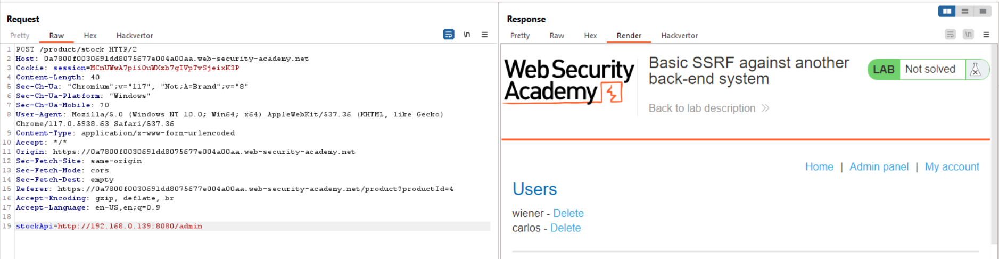

# Basic SSRF against another back-end system

1. SSRF: Stock check function.
2. Goal: Use the stock check functionality to scan the internal 192.168.0.X range for an admin interface on port 8080, then use it to delete the user carlos.

### Analysis

- Decode this URL.

- Brute froce.

- I found `192.168.0.139:8080`. 

- Delete `carlos` user.

