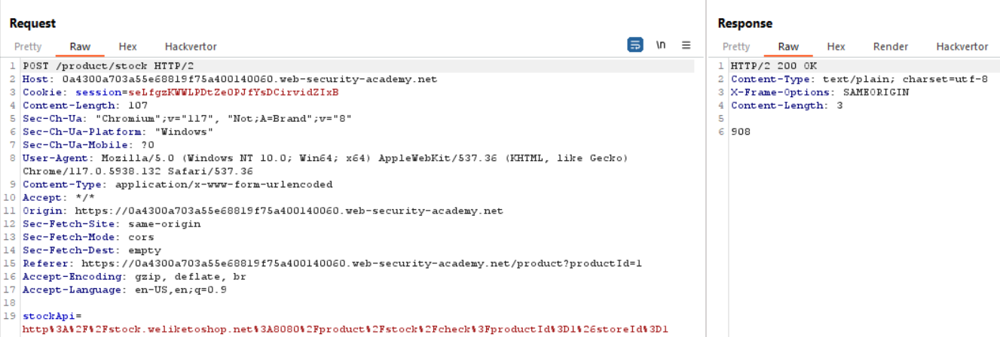
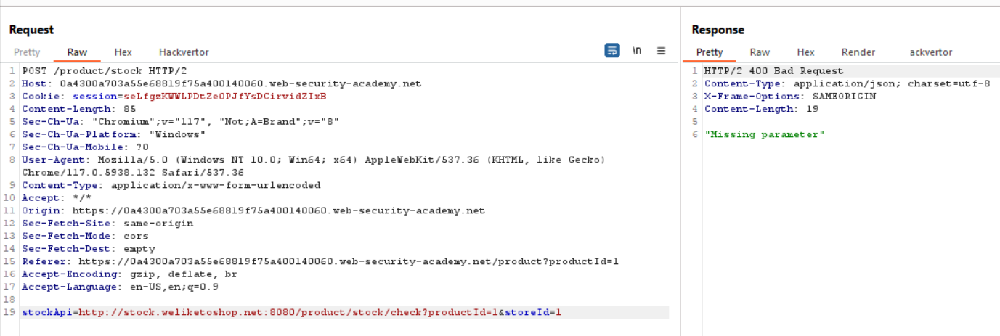
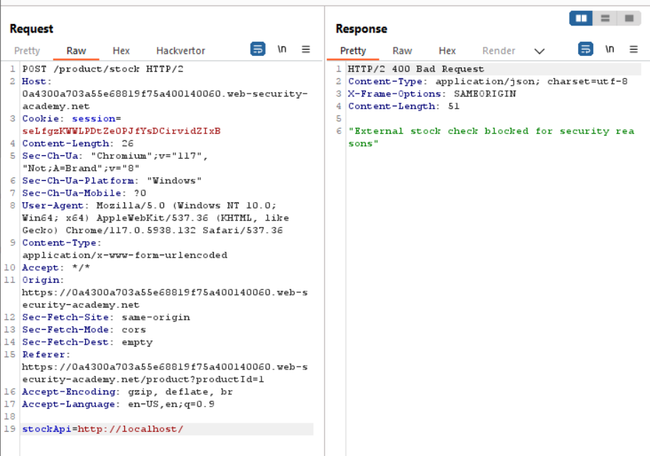
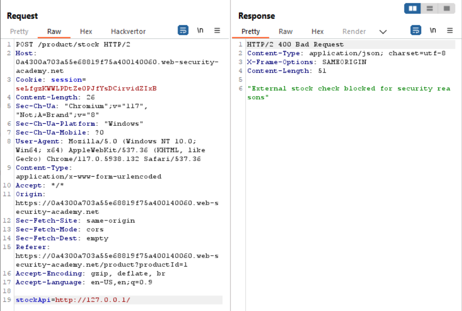
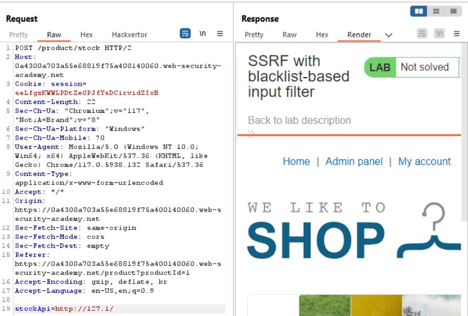
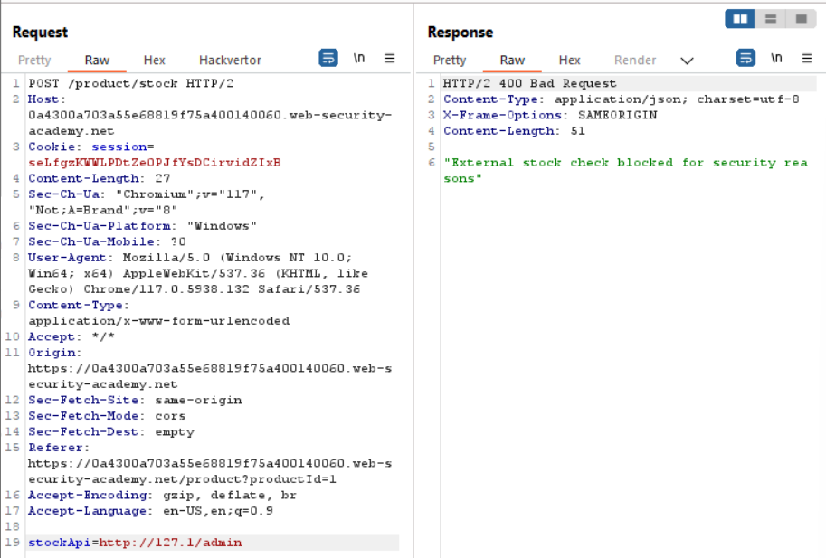
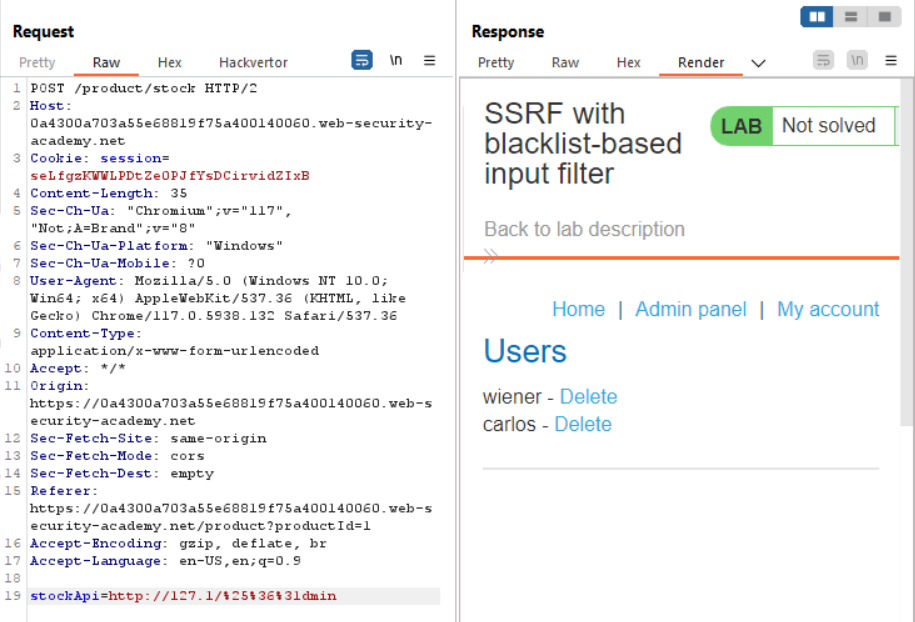
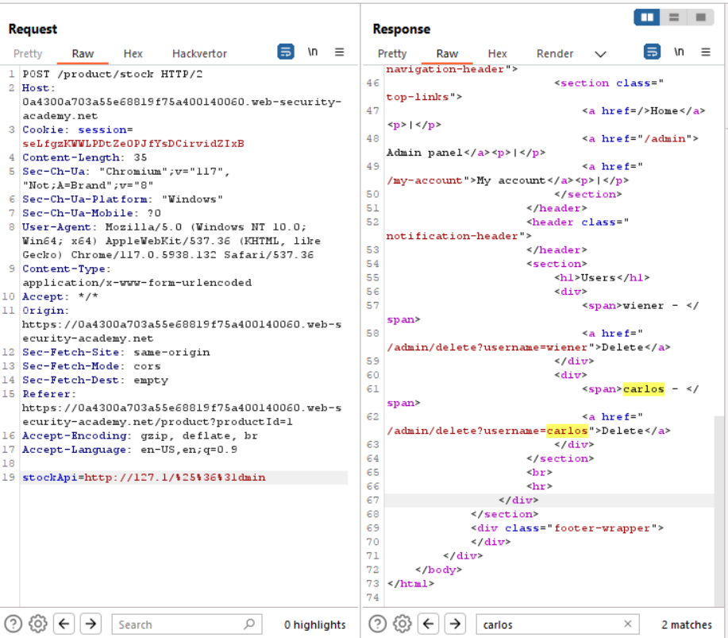
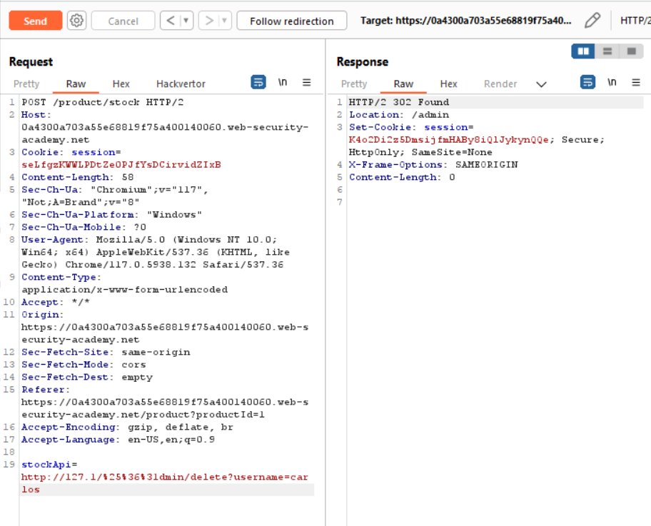
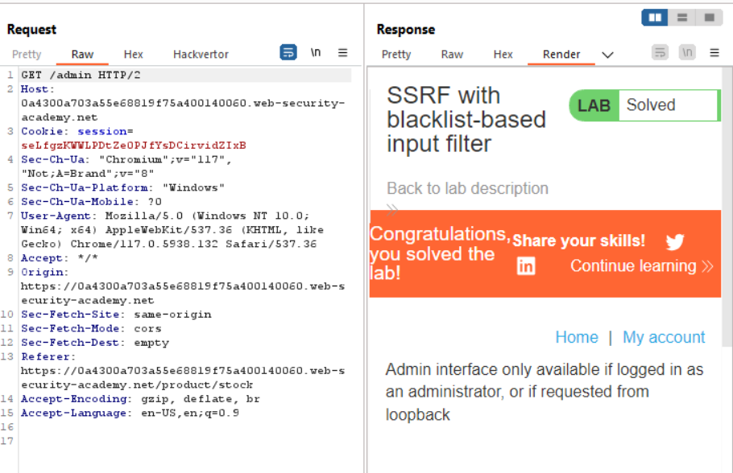

# SSRF with blacklist-based input filter

1. SSRF: Stock check funtion.
2. Goal: Change the stock check URL to access the admin interface at http://localhost/admin and delete the user carlos.

### Analysis

1. Decode URL. 

2. `http://localhost/` - I got block.

3. `http://127.0.0.1/` - Still got block.

4. `http://127.1/` - Use this for bypass.

5. `/admin` - I got another block. 

6. I use double url encode - `Convert selection > URL > URL-encode all characters`.

7. Now, delete `carlos` user.

