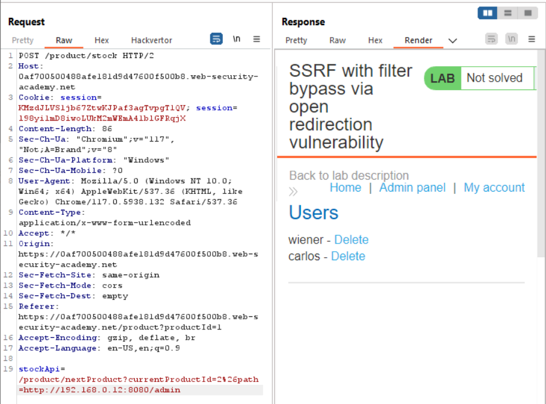

# SSRF with filter bypass via open redirection vulnerability

1. SSRF: Stock check function.
2. Goal: Change the stock check URL to access the admin interface at http://192.168.0.12:8080/admin and delete the user carlos.

### Analysis

- Encode URL.

- Now, delete  `carlos` user.

